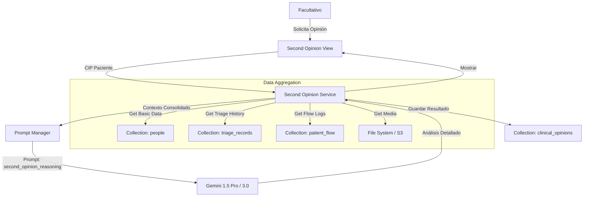

# Diseño Funcional y Técnico: Módulo de Segunda Opinión (Reasoning ++)

## 1. Visión General

Este módulo proporciona una funcionalidad de **"Segunda Opinión Experta"** independiente del flujo de triaje operativo. Su objetivo es permitir a un facultativo (o auditor) solicitar un análisis profundo de un caso complejo utilizando modelos de **IA de Razonamiento Avanzado** (ej. Gemini 2.5 Pro, o futuros Gemini 3.0), sin afectar los tiempos de respuesta del triaje estándar.

### Características Clave

* **Asincronía/Independencia:** No bloquea el flujo principal del paciente.
* **Modelo "Reasoning ++":** Utiliza modelos más costosos y lentos, pero con mayor ventana de contexto y capacidad deductiva.
* **Contexto Completo:** Agrega todos los datos disponibles (Triajes previos, Historia, Archivos Multimedia, Constantes).

---

## 2. Arquitectura del Sistema

### 2.1 Componentes Nuevos

1. **`src/services/second_opinion_service.py`**:

   * Orquestador principal.
   * Responsable de la agregación de datos (`Data Aggregator`).
   * Cliente específico para modelos de alto rendimiento.
2. **`src/ui/modules/second_opinion_view.py`**:

   * Interfaz dedicada (tab o página independiente).
   * Selector de paciente (Búsqueda por CIP/Ticket).
   * Panel de visualización de razonamiento (Chain of Thought).
3. **Prompt dedicado (`second_opinion_reasoning`)**:

   * Gestionado en `PromptsRepository`.
   * Configurado explícitamente para usar modelos `gemini-1.5-pro` (o superior).

### 2.2 Diagrama de Flujo de Datos



---

## 3. Integración con Módulos Existentes

### 3.1 Prompt Manager (`src/db/repositories/prompts.py`)

Se aprovechará la capacidad existente de asignar modelos específicos a versiones de prompts.

* **Nuevo Prompt Type:** `second_opinion_audit`.
* **Configuración:**
  * *Version:* `v1`
  * *Model:* `gemini-1.5-pro` (Reasoning Model).
  * *Temperature:* `0.1` (Más determinista/analítico).

### 3.2 Modo Contingencia (`src/services/contingency_service.py`)

Dado que este no es un proceso crítico en tiempo real (como la admisión):

* **Comportamiento Offline:** Si el sistema está en contingencia, este módulo **se deshabilita** completamente.
* **Graceful Degradation:** Muestra un mensaje "Servicio de Segunda Opinión no disponible con conectividad degradada". No intentará ejecución local (SLM) ya que requiere alta capacidad de cómputo (Cloud).

### 3.3 Base de Datos

* **Input:** Lectura de `people` (datos filiación), `triage_records` (signos vitales, quejas), y `files_metadata` (referencias a imágenes/audio).
* **Output:** Nueva colección `clinical_opinions` para persistir estos análisis costosos y evitar re-ejecución innecesaria.

---

## 4. Agregación de Datos (The "Context Builder")

El `SecondOpinionService` implementará un método `build_patient_context(patient_code)` que construirá un JSON masivo:

```json
{
  "patient": { "age": 45, "gender": "F", "history": [...] },
  "current_episode": {
    "arrival": "2024-12-07T09:00:00",
    "complaint": "Dolor torácico",
    "vitals": { "bp": "140/90", "hr": 95, "sat": 98 }
  },
  "multimedia_analysis": [
    { "type": "audio_transcription", "content": "Paciente refiere dolor opresivo..." },
    { "type": "image_analysis", "original_id": "img_001", "ai_description": "Electrocardiograma mostrando..." }
  ],
  "timeline": [
    { "time": "09:05", "event": "Admisión" },
    { "time": "09:15", "event": "Triaje (Manchester: Amarillo)" }
  ]
}
```

## 5. Estrategia de Implementación (Roadmap Sugerido)

1. **Fase 1: Backend & Prompt:** Crear el tipo de prompt y el servicio de agregación de datos.
2. **Fase 2: Conexión IA:** Implementar la llamada a Gemini Pro con el contexto agregado.
3. **Fase 3: UI:** Crear la vista en "Herramientas Avanzadas" o "Casos Clínicos".

---

**Nota:** Este diseño cumple con el requisito de usar "Reasoning ++" integrándose transparentemente con la infraestructura de control de costes y auditoría ya desarrollada.
